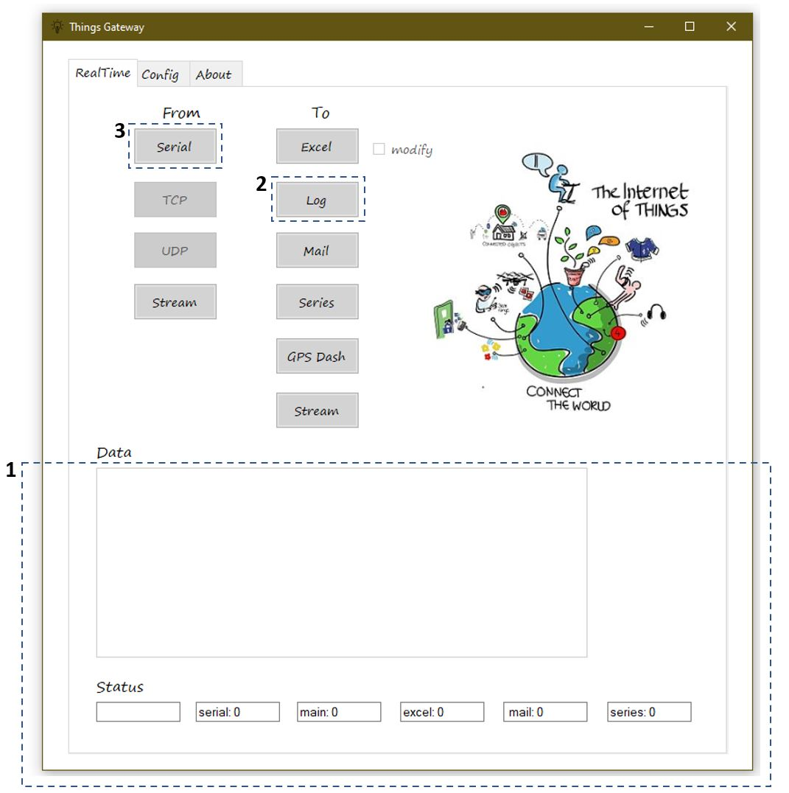
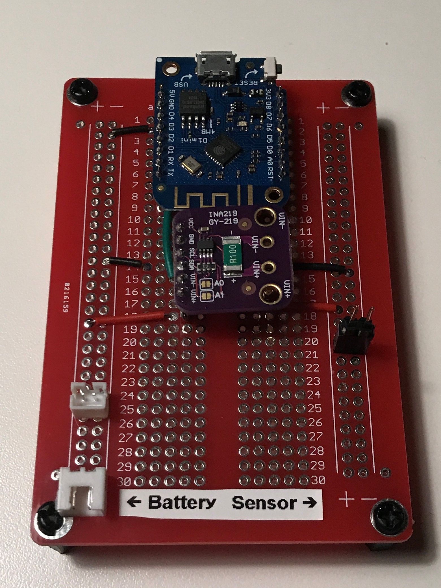
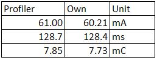
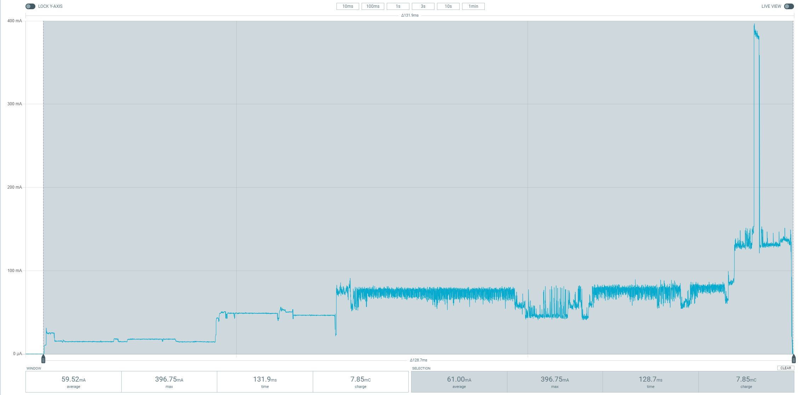

# INA219_Power_Meter_Thingsgateway
INA219 Power Meter to Thingsgateway.

Logg every 2ms (2ms, baud 500 000, CPU 160MHz)! Mostly 2ms but sometimes 4ms.  
Logging 3ms is more stable though. 

Serial logger (full credits to Roberto Valgolio): 
http://www.robertovalgolio.com/sistemi-programmi/ecosystemofthings

Name output to csv instead of txt. 
Put Things gateway so that live serial output is inder screen for stability. 

1. Move Things gateway so that serial output (area marked 1) is "under" computer screen (increases stability)
2. Start logg to file (2)
3. Start logging serial (3)

When finished first unpress 3 and then wait for writing to file to stop (file size not increasing anymore). Then press 2. 

Connections: 
- Wemos 3.3V -> INA219 VCC
- Wemos GND -> Battery GND, INA219 GND and Sensor GND
- Wemos D2 -> INA219 SDA
- Wemos D1 -> INA219 SCL
- INA219 V+ -> Battery PWR
- INA219 V- -> Sensor PWR

Comparison:

Own measurement (This repo and 3.7V):

Measured with Power Profiler Kit II (3.7V):

